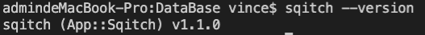
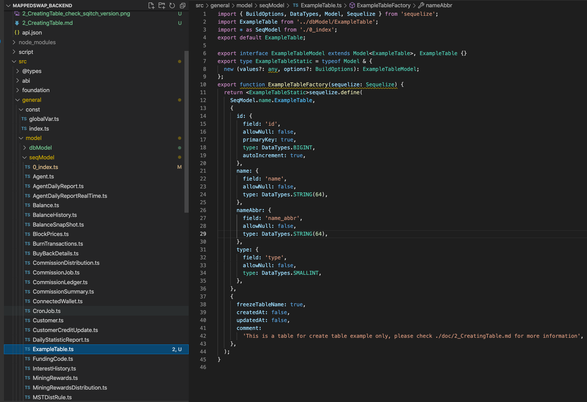
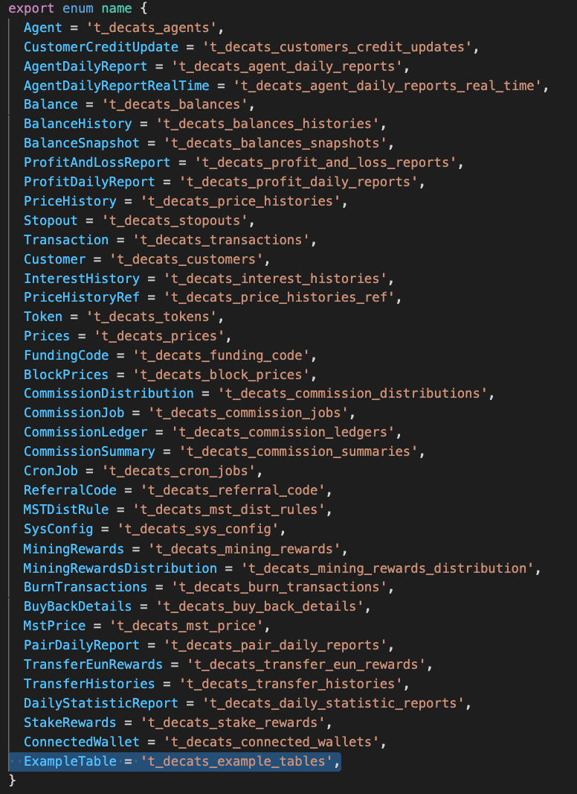
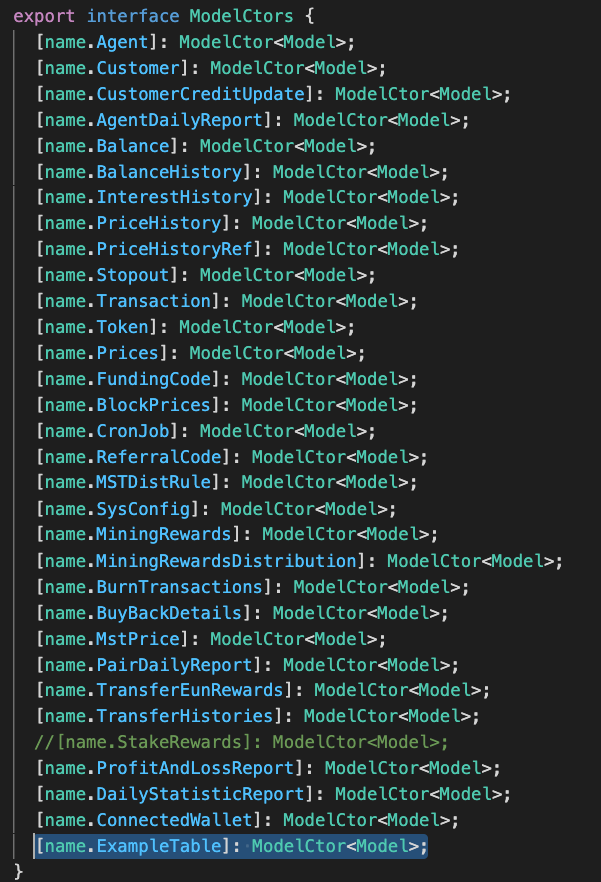
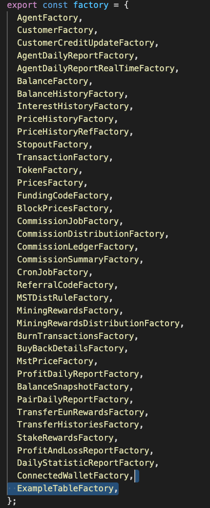
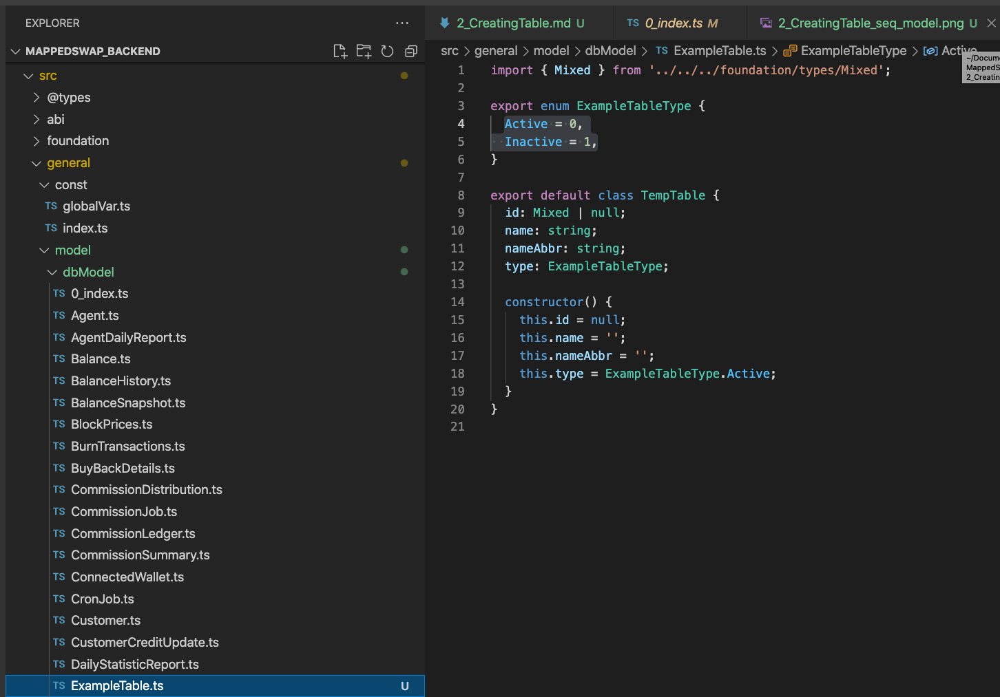
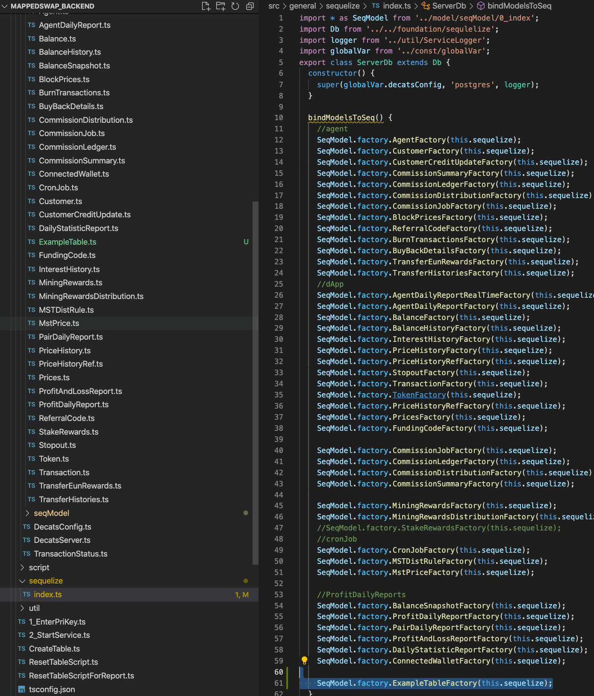

# [ MappedSwap-API ] Create table

This documentation explain how you can create table through **sequelize** framework and manage database change by **sqitch**

## Prerequisites

1. Install sqitch

```
   https://sqitch.org/download/macos/
   brew tap sqitchers/sqitch
   brew install sqitch --with-postgres-support --with-sqlite-support
```

2. Test sqitch is installed

```
  sqitch --version
```



# Development (Environment setup)

1. Get the projects from https://github.com/Mapped-Swap/DeCATS-backend
2. cd to MappedSwap_Backend folder
3. Put the config files in Mapped-Swap/DeCATS-backend/config, there will be [dev] and [local] environment by default
4. Open Terminal (#) in this path : Mapped-Swap/DeCATS-backend

```terminal
   node -v, to check node version :14.18.0
   npm install
```

If node js has not been installed, install node js 14.18.0

```
   # install node 14.18.0
   wget -qO- https://raw.githubusercontent.com/nvm-sh/nvm/v0.39.1/install.sh | bash
   nvm install 14.18.0
```

You may need to install git to perform npm install

```
   yum install git
```

Then run npm install

```
   # cd path_to_MappedSwap_BackEnd
   npm install
```

Compile contracts

```
   cd src/server/onlineDataFetcher/smartcontract/v3-core-main
   #ln -s /home/centos/.nvm/versions/node/v14.18.0/bin/node /usr/bin/node
   npm install
   npm run compile
```

# Development (Create table example)

1. Open a file call ExampleTable.ts in `src/general/model/seqModel`. this file contains ExampleTable table definition

   - **TABLE NAME SHOULD BE `PLURAL` AND `snake_case` AND START WITH `t_decats_`**
     - `t_decats_example_tables`



1. Add ExampleTable related fields in `src/general/seqModel/0_index.ts`

- name

  

- ModelCtors

  

- factory

  

- association (if any)

1. Open a file call ExampleTable.ts in `src/general/model/dbModel`, this file define class for ExampleTable and related enum. Please notice property name must match the column name which defined in seqModel

   - **CLASS NAME SHOULD BE `SINGULAR`**
     - `ExampleTable.ts`
   - **CLASS NAME SHOULD BE `PascalCase`**
     - `ExampleTable.ts`
   - **ENUM NAME SHOULD BE `PascalCase`**
     - ` export enum ExampleTableType { Active = 0, Inactive = 1, }`



2. Add ExampleTable factory to `src/sequelize/index.ts` bindModelsToSeq() function

- association only needed when you want to use include


