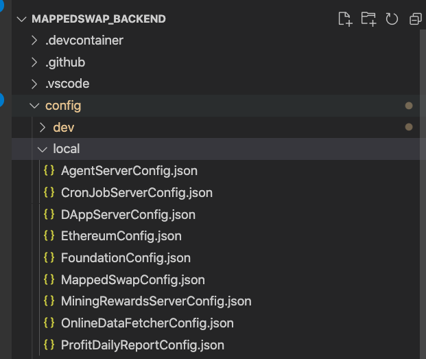
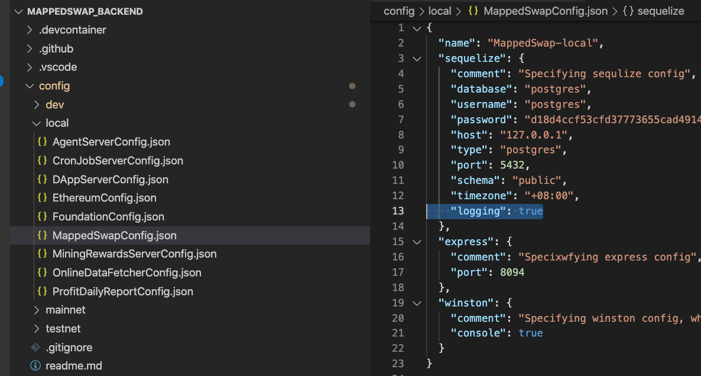
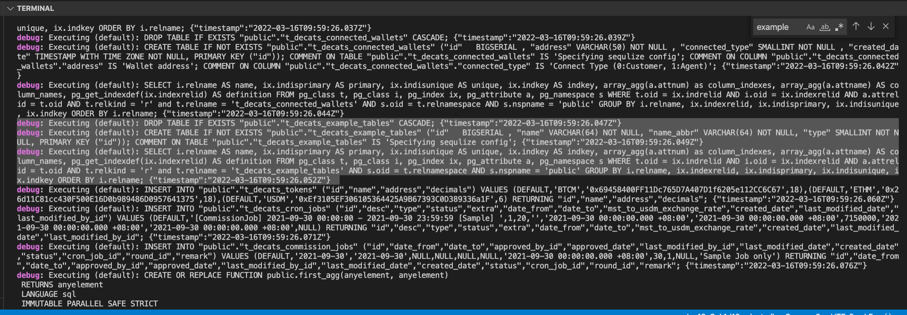

# [ MappedSwap-API ] Reset table by sequelize

# Development (Reset database by sequelize)

```diff
- THE FOLLOWING APPROACH WILL DROP ALL TABLES AND ERASE RELATED DATA, MAKE SURE YOU ARE USING LOCAL ENVIRONMENT
```

The following example shows how to use sequelize to reset database

Source File :

1. `src/general/ResetTableScript.ts` \* use this normally
2. `src/general/ResetTableScriptForReport.ts` \* use for debugging for agent daily reports, normally not used

Basically, you only need to modify `src/general/ResetTableScript.ts` for development

1. Make sure you have the local config pointed at the correct database credential in `config` folder
   
2. Use vscode debugger, clicks `[Local] Init Db`, this will run `src/general/1_EnterPriKey.ts` and then eventually leads to `src/general/ResetTableScript.ts`
3. `src/general/ResetTableScript.ts` will drop and sync all the table in `src/general/sequelize/index.ts`
4. If you want to insert dummy data in a table, you can write the code in `src/general/ResetTableScript.ts`
5. Before start the service, you can set `sequelize.logging = true` to see the actual SQL running from sequelize frameworks, please notice that this applies on start



1. You can see the SQL actually running in terminal

2. Copy the sql related to ExampleTable table, it will be needed in 4_deploy_table_change_by_sqitch.md


