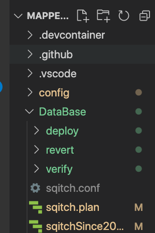
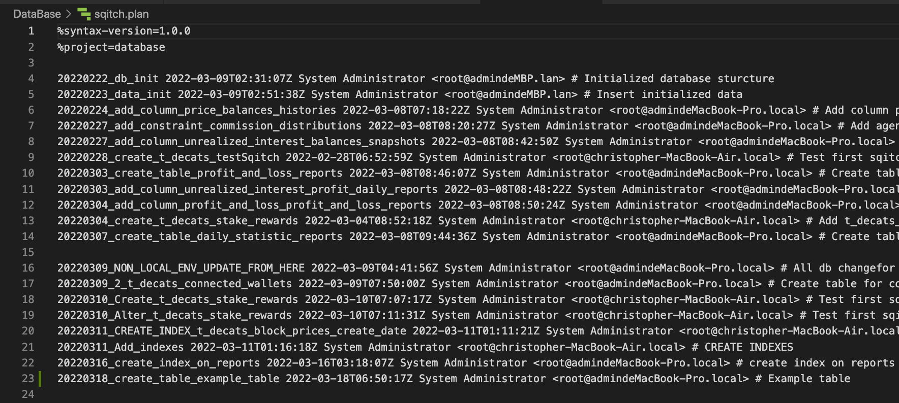
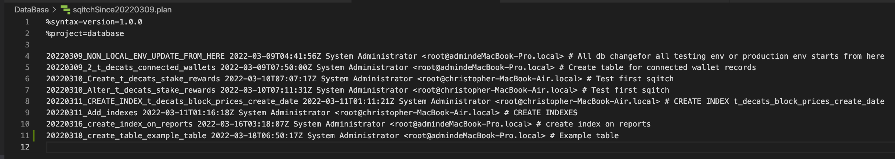
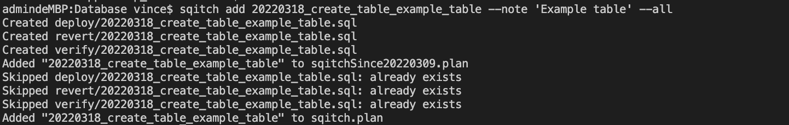
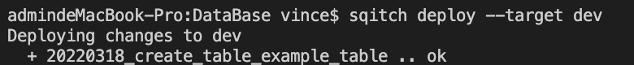
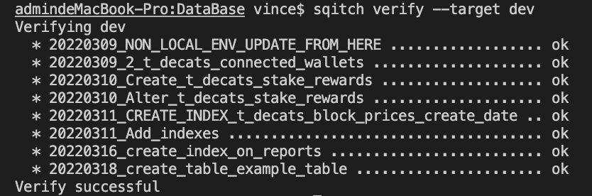
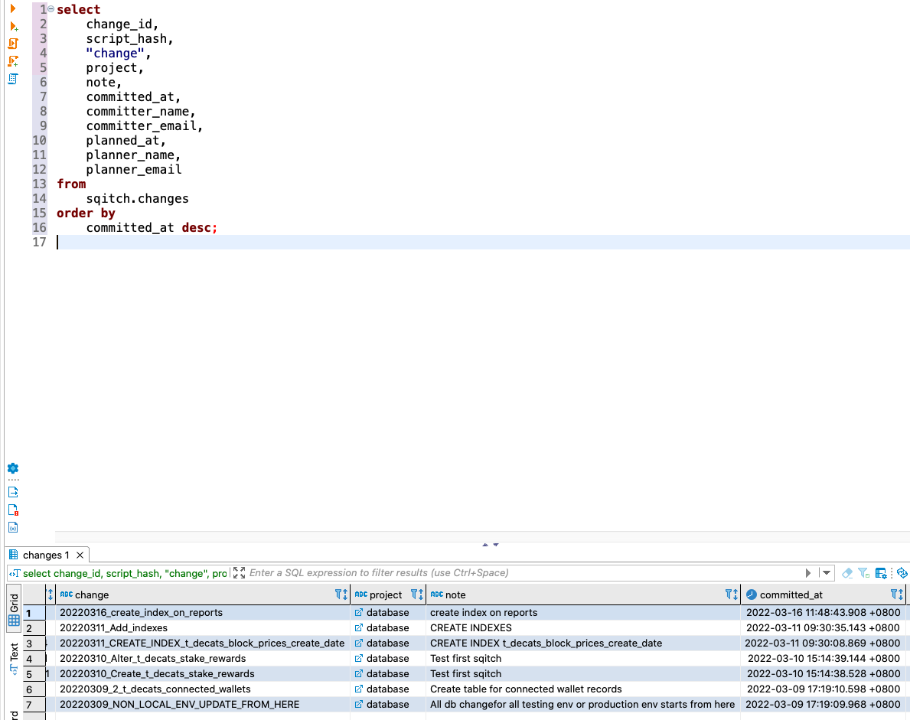

# [ MappedSwap-API ] Deploy database change by sqitch

MappedSwap project use sqitch for database management

## Setup sqitch enviroment

https://sqitch.org/

1. Download sqitch

   ```
   https://sqitch.org/download/macos/
   brew tap sqitchers/sqitch
   brew install sqitch --with-postgres-support --with-sqlite-support
   ```

2. verify sqitch is installed

   ```
   sqitch --version
   ```

3. cd into ./Database foler

   

4. Add enviroment by `sqitch target add`

   ```diff
   - **Please never git push any production env in this file**
   ```

   ```
   sqitch target add dev 'db:pg://christopher:\_PW0E,emS3+<xW>S^nZQ@13.228.21.221:5432/postgres'
   db:pg://dba@example.net/blanket
   ```

## Sqitch Plan

There are 2 sqitch plans in this project

1. sqitch.plan - `Use to initialize database from the start`, use in local, or new enviroment

   

1. sqitchSince20220300.plan - `Due to sqitch is added in the later stage of this page, this plan only deploy changes after 2022-03-09`, use in dev, testnet and mainnet

   

## Example on creating new table

**Example, 20220318_create_table_example_table**

1. First, type command `sqitch add [name of the change] --note [note] --all`. This will add changes to plan

   `--all` means add this change to all plan which already specifid in sqitch.conf

   ```
   sqitch add 20220318_create_table_example_table --note 'Example table' --all
   ```

   

2. Then, type in the sql which will make changes to database in ./DataBase/deploy/xxxxxxxx.sql, which is generated perviously in Step (1), e.g. `20220318_create_table_example_table.sql`

   `Database/deploy/20220318_create_table_example_table.sql`

   ```
   -- Deploy database:20220318_create_table_example_table to pg

   BEGIN;

   -- XXX Add DDLs here.
   CREATE TABLE IF NOT EXISTS "public"."t_decats_example_tables"
   (
       "id"   BIGSERIAL ,
       "name" VARCHAR(64) NOT NULL,
       "name_abbr" VARCHAR(64) NOT NULL,
       "type" SMALLINT NOT NULL,
       PRIMARY KEY ("id")
   );
   COMMENT ON TABLE "public"."t_decats_example_tables" is 'Example table, please check ./doc/2_creating_table.md';

   COMMIT;
   ```

3. Enter the revert sql which will revert the sql from deploy statement. i.e., since this example is to create table, the revert sql drop the table t_decats_example_table

   `Database/revert/20220318_create_table_example_table.sql`

   ```
   -- Revert database:20220318_create_table_example_table from pg

   BEGIN;

   -- XXX Add DDLs here.
   DROP TABLE "public"."t_decats_example_tables" ;

   COMMIT;
   ```

4. Enter the verify sql which can be used the deployed sql actually performed. i.e., since this example is to create table, the verify sql should be select 1 record from `t_decats_example_table`

   `Database/verify/20220318_create_table_example_table.sql`

   ```
   -- Verify database:20220318_create_table_example_table on pg

   BEGIN;

   -- XXX Add verifications here.
   SELECT * from "public"."t_decats_example_tables" LIMIT 1;

   ROLLBACK;

   ```

5. After enter all sql for deploy, verify and revert, you can now perform changes to database by sqitch deploy.

   **For testing and production**

   ```
   sqitch deploy --target dev
   sqitch deploy --target testnet
   sqitch deploy --target [other env]
   ```

   **For local**

   ```
   sqitch deploy --target local
   ```

   The deployed changes will use plan according to `sqitch.conf`, i.e. since dev is using sqitchSince20220309.plan, it will deploy changes from there only.



6. Type verify command to verify all changes
   ```
   sqitch verify --target dev
   sqitch verify --target testnet
   sqitch verify --target [other env]
   ```



Sqitch will auto detect undeployed changes from database record



# **Warning**

**sqitch revert**

make sure using sqitch revert --to <change_name> when perform revert, since revert sql might contains drop table sql, it must not reverting all changes for testing and production enviroment

```
sqitch revert --target dev --to-change 20220318_create_table_example_table
```

The above command only revert dev enviroment to 20220318_create_table_example_table

# Useful command

- Deployment

  Deploy changes to different enviroments

  ```
     sqitch deploy --target dev
     sqitch deploy --target testnet
     sqitch deploy --target mainnet
     sqitch deploy --target local
  ```

  Deploy specific change

  ```
     sqitch deploy --target dev --to-change 20220318_create_table_example_table
  ```

- Revert change to specific change
  ```
     sqitch revert --target dev --to-change 20220318_create_table_example_table
  ```
- Verify all change

  ```
     sqitch verify --target dev
  ```

- SQL to query database changes

  ```
  select
      change_id,
      script_hash,
      "change",
      project,
      note,
      committed_at,
      committer_name,
      committer_email,
      planned_at,
      planner_name,
      planner_email
  from
      sqitch.changes
  order by
      committed_at desc;

  ```

### sqitch.conf (For ref., **dev** and **local** only)

```
[target "local"]
uri = db:pg://postgres:%5C_PW0E,emS3+%3CxW%3ES%5EnZQ@localhost:5432/testing
plan_file = sqitch.plan
[target "dev"]
uri = "db:pg://christopher:_PW0E%2CemS3%2B%3CxW%3ES%5EnZQ@13.228.21.221:5432/postgres"
plan_file = sqitchSince20220309.plan
```
