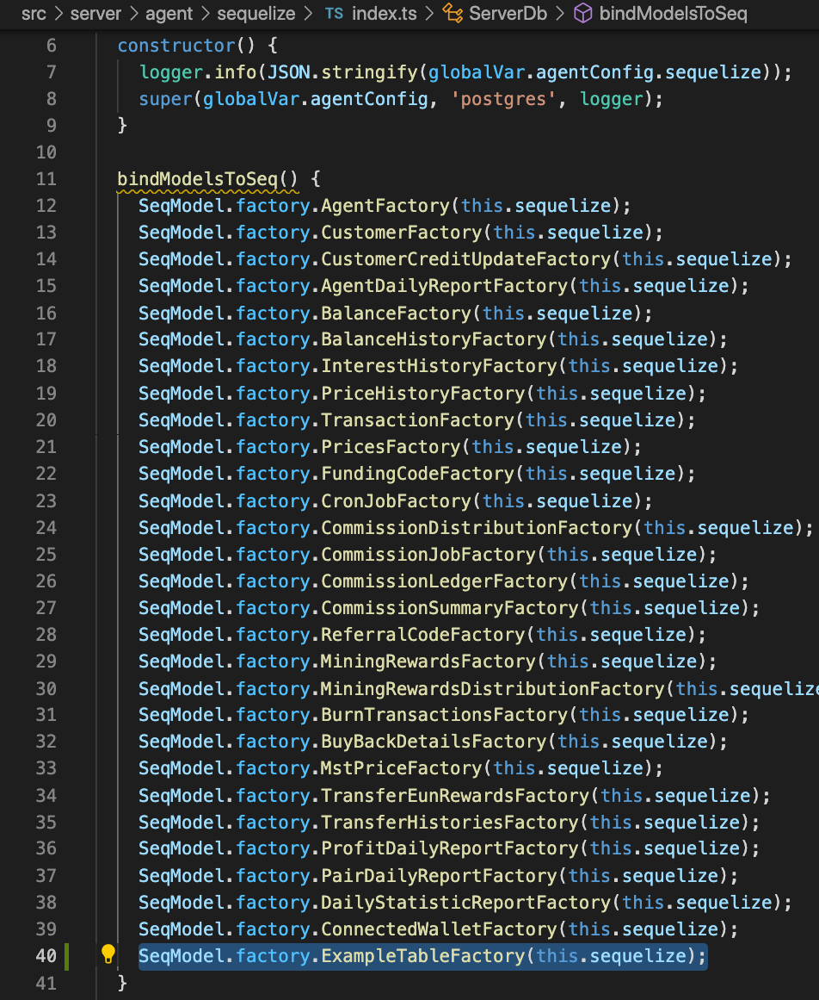
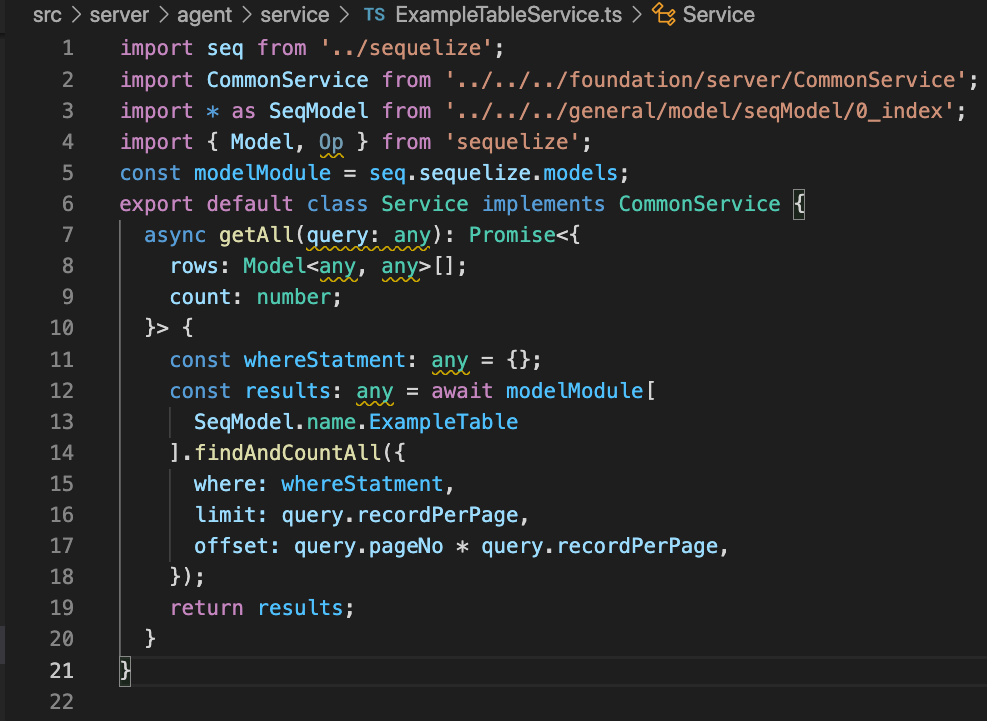
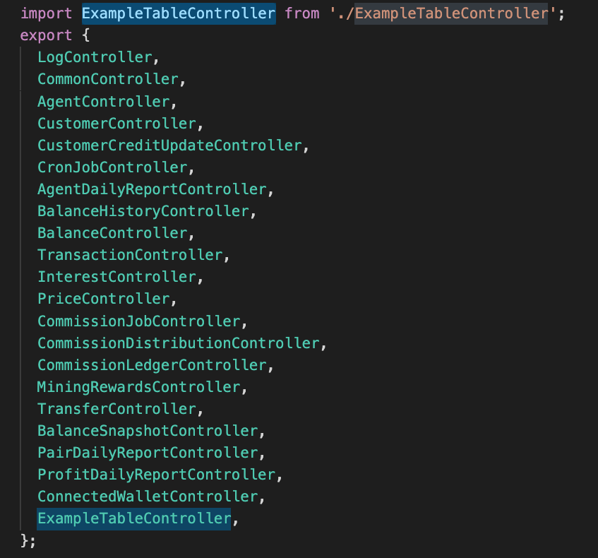
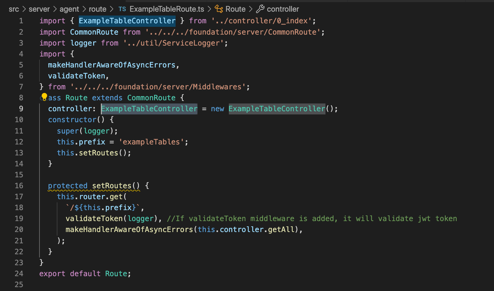
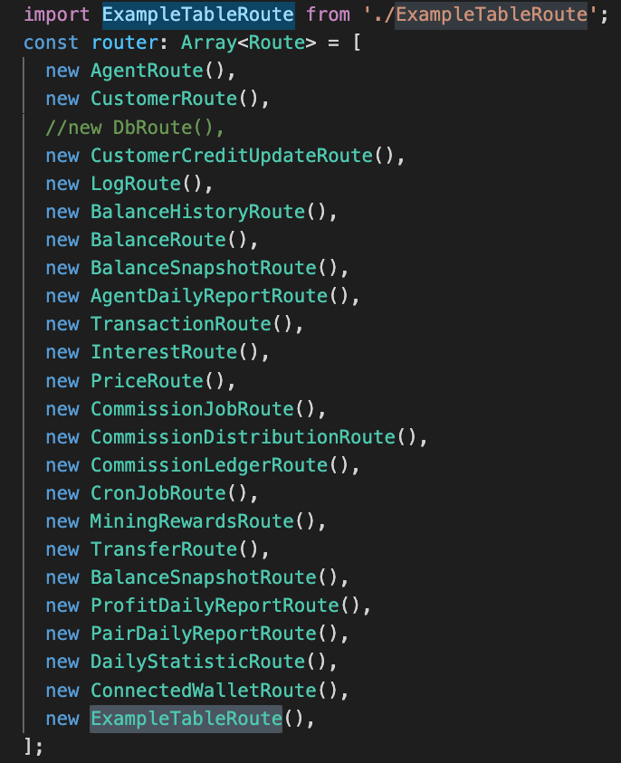

# [ MappedSwap-API ] Express API strcture

MappedSwap project use express for backend api and sequelize for entity model

**-----Here we use agent service for example-----, it might be different if u use other service**

### Useful ref.

- src/server/agent/sequelize/index.ts
- src/server/agent/route/ExampleTable.ts
- src/server/agent/controller/ExampleTable.ts
- src/server/agent/service/ExampleTable.ts

## Sequelize

### For sequelize able to reference model entity, the factory must be presented in sequelize/index.ts

1. Add the factory method inside function bindModelsToSeq() of `src/server/agent/sequelize/index.ts`

   ```
       SeqModel.factory.ExampleTableFactory(this.sequelize);
   ```

   

## Service

### Actual logic implementation, use of database

1. Add ExampleTableService.ts in src/server/agent/service folder

2. Add `getAll` function which will be used to get all data of `t_decats_example_table` in the service

   ```
    async getAll(query: any): Promise<{
        rows: Model<any, any>[];
        count: number;
    }> {
        const whereStatment: any = {};
        const results: any = await modelModule[
        SeqModel.name.ExampleTable
        ].findAndCountAll({
        where: whereStatment,
        limit: query.recordPerPage,
        offset: query.pageNo * query.recordPerPage,
        });
        return results;
    }
   ```

   

3. Make sure the model entity you are referencing for `SeqModel.name.ExampleTable` is already put in the service/sequelize/index.ts

## Controller

### Assign request to service to handle and validate request body/params

- src/server/agent/controller
- etc...

For example, if there is a requirement that get all the data from `t_decats_example_table`

1. Add ExampleTableController.ts in src/server/agent/controller folder

2. Add `getAll` function which will be used to get all data of `t_decats_example_table` in the constructor

   ```
     constructor(
        private service: Service = new Service(),
        private val: ValidationHelper = new ValidationHelper(),
    ) {
        this.val.throwError = true;
        this.getAll = this.getAll.bind(this);
    }
   ```

3. Add `getAll` controller function, in controller, you should validate the request body or request param using ValidationHelper or any other means

   ```
    async getAll(req: any, res: any) {
        try {
            this.val.isNullOrEmpty(req.query.recordPerPage, 'recordPerPage');
            this.val.isNum(req.query.recordPerPage, 'recordPerPage');
            this.val.isNullOrEmpty(req.query.pageNo, 'pageNo');
            this.val.isNum(req.query.pageNo, 'pageNo');
        } catch (e: any) {
            return apiResponse(
                res,
                new WarningResponseBase(ServerReturnCode.InvalidArgument, e.message),
                statusCode(false, 'query'),
            );
        }

            req.query.agentId = req.jwt.id;
            const data = await this.service.getAll(req.query);
            return apiResponse(
            res,
            responseBySuccess(data, true, 'query', 'success', 'Founded'),
            statusCode(true, 'query'),
        );
    }
   ```

4. Make sure the Service you are referencing for `this.service` is pointing at the correct service, i.e. ExampleTableService

   ```
    import Service from '../service/ExampleTableService';
   ```

5. Put the newly created controller in controller/0_index.ts for easy import
   

## Route

### Route means the api route, which will normally locates in each micro service/route

- src/server/agent/route
- etc...

For example, if there is a requirement that get all the data from `t_decats_example_table`

1. Add ExampleTableRoute.ts in src/server/agent/route folder

2. Set the prefix as plural and camelCase

   ```
   this.prefix = 'exampleTables';
   ```

3. Change the controller to ExampleTableController

4. Add the route inside `setRoutes()` function

   ```
    protected setRoutes() {
        this.router.get(
        `/${this.prefix}`,
        validateToken(logger), //If validateToken middleware is added, it will validate jwt token
        makeHandlerAwareOfAsyncErrors(this.controller.getAll),
        );
    }
   ```

   

5. If this api does not need jwt validation, simple remove the `validateToken(logger)`

   ```
    protected setRoutes() {
        this.router.get(
        `/${this.prefix}`,
        makeHandlerAwareOfAsyncErrors(this.controller.getAll),
        );
    }
   ```

6. `makeHandlerAwareOfAsyncErrors` catch any error happened in its function parameter, in this example, if error occurs in `this.controller.getAll`, and is not catched by another other try catch, this middleware will transform the error and return an error response

7. Put the newly created route in route/0_index.ts for easy import
   

8. Now that we are ready, these route can be used be express in the next chapter
