# DeCATS 代理系統

Agent system在DeCATS系統的位置，用於管理

- 分層代理（包括手續費及利息分成比例）
- 客戶信息就授信
- 分潤設置
- 代理日報表（收入報表）

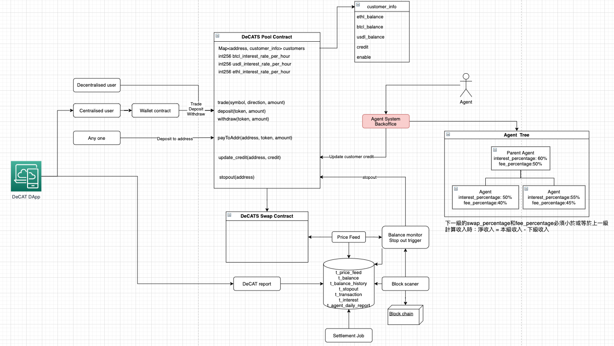

## 1 首頁

顯示用戶關心的圖表，包括一下內容

### 1.1 授信帳戶

- 授信額度
- 客戶使用額度
- 代理使用額度
- 可用授信額度

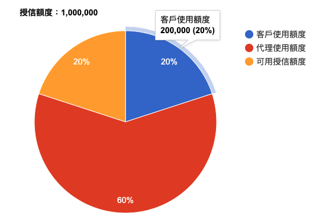

### 1.2 客戶/代理數目

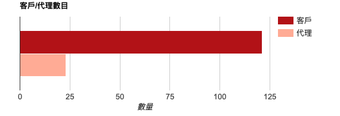

### 1.3 收入分佈

- 直客手續費收入
- 直客利息收入
- 代理手續費收入
- 代理利息收入

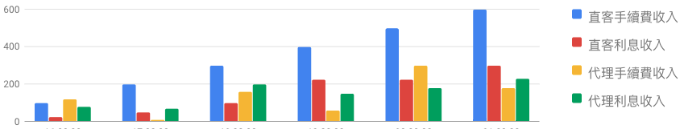

### 1.4 信用額度使用

- 直客使用信用額度

- 下級代理使用信用額度

  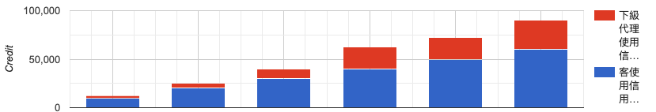

  

## 2 代理管理

### 2.1 代理資料

查看當前登入代理帳號的帳號資料

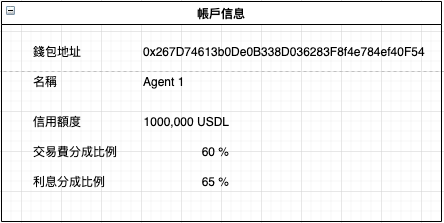

- 錢包地址
  可選擇綁定錢包地址，用於日後接收分潤

- 名稱

  用戶名稱

- 電郵地址

  用於接收系統信件及登入

- 密碼

  用於登入代理系統

- 信用額度

  由上層代理分配，可用於分配給直客及下層代理的信用額度

- 交易費分成比例

  由上層代理分配，表示當層節點可以分配的交易費的分成比例。下層代理的分成比例必須小於或等於上層代理。

- 利息分成比例

  由上層代理分配，表示當層節點可以分配的手續費的分成比例。下層代理的分成比例必須小於或等於上層代理。

*計算分潤邏輯請參考代理結算報表部分*

### 2.2 添加代理

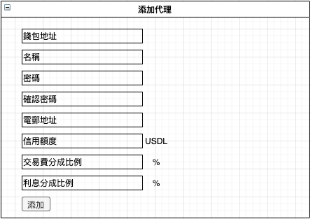

### 2.3 代理列表

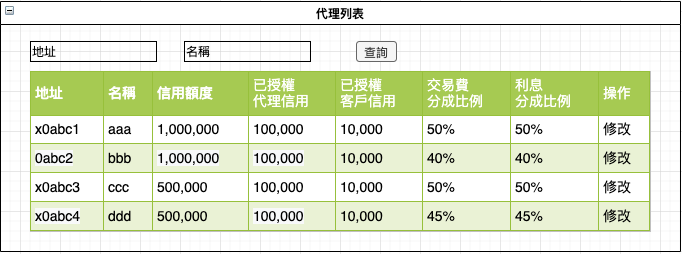

### 2.4 修改代理

從代理列表進入

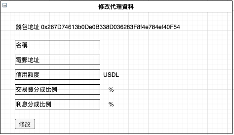

## 3 客戶管理

### 3.1 添加客戶

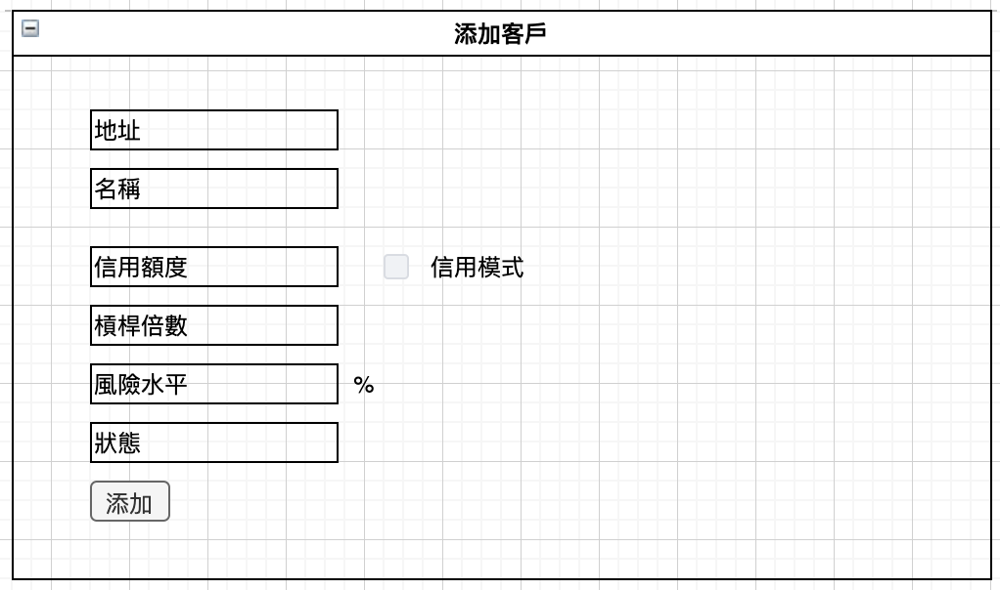

- 地址

  用於區分用戶的唯一方式

  對於decentralized 用戶，使用用戶錢包地址

  對於centralized用戶，使用Eurus user contract的地址

  該地址也用於用戶存款及取款

- 名稱

  用戶名稱

- 信用額度

  直屬代理分配給該用戶可用於交易的信用額度

- 信用模式

  開啟後啟用純信用模式，可以不用deposit直接交易，可用於交易的保證金是 credit / leverage

- 槓桿倍數

  用於計算用戶的保證金 
  $$
  margin = usedCredit/leverage
  $$
  

  及信用模式下可用於交易的保證金
  $$
  maginCredit = credit / leverage
  $$
  
- 風險水平

  直屬代理可以為客人設置風險水平
  $$
  riskLevel = 1- (equity * leverage + credit * isCreditMode) / creditUsed
  $$
  當creditUserd = 0時，返回riskLevel = 0

  當riskLevel < 0, 返回riskLevel = 0

  當riskLevel大於於設置的風險水平，會進行stopout，強平除了USDL意外的倉位。

  RiskLevel設置得越低，代理的風險越低。

  |                                                      |             Margin Mode             |                  Credit Mode                  | Comment    |
  | ---------------------------------------------------- | :---------------------------------: | :-------------------------------------------: | ---------- |
  | riskLevel formula                                    | 1- (equity * leverage) / creditUsed | 1 - (equity * leverage + credit) / creditUsed |            |
  | 預計虧損（假設risk level = 100%強平後）              |              所有存款               |                credit/leverage                |            |
  | Equity（假設risk level = 100%強平後）                |                  0                  |               -credit/leverage                |            |
  | 開始 Risk Level                                      |                  0                  |                       0                       | 無使用信用 |
  | 當creditUsed > 0，equity = 0時 Risk Level       |             1（高風險）             |                  0（無風險）                  |            |
  | 當 -credit/leverage < equity  < 0 時 Risk Level |           >1（極高風險）            |                    (0, 1)                     |            |
  | 當 equity <= -credit/leverage 時 Risk Level     |           >1（極高風險）            |               >= 1（極高風險）                |            |

  

- 狀態

  客戶狀態，包括：啟用/禁用

### 3.2 客戶列表

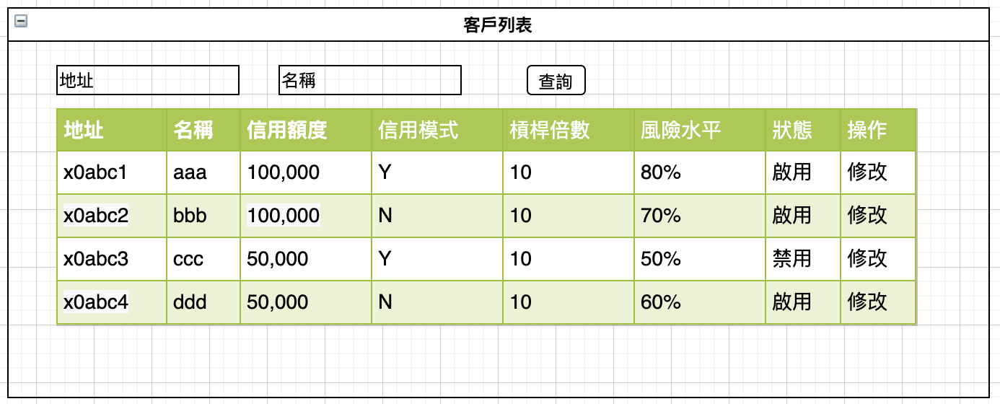

### 3.3 修改用戶紀錄

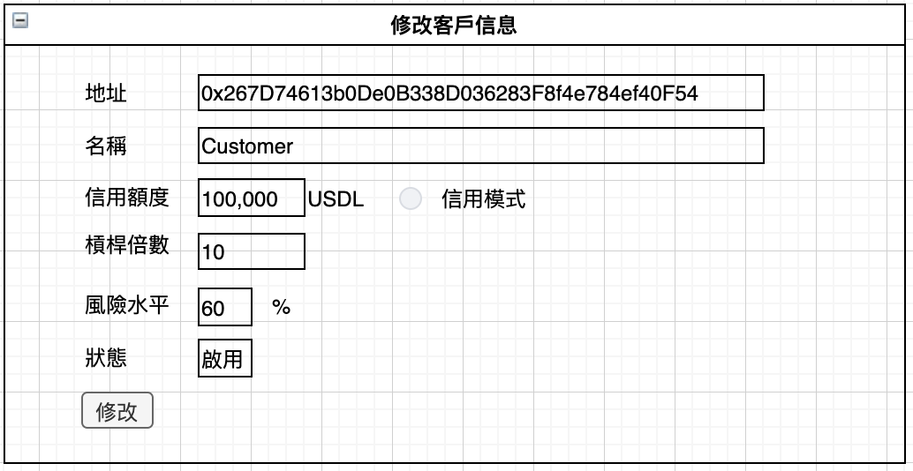

### 3.4 客戶授信紀錄

因為客戶信用是紀錄在Credit pool contract 裡面，需要調用smart contract進行修改。Eurus網絡確認請求後才最終生效。

可以分為以下幾種情況

- 增加授信額度
  - 預先在代理可用的額度池中扣除所增加額度增加的差額。
  - 當請求被Rejected，增加的額度重新添加會代理可用的額度池中。
- 減少授信額度
  - 額度減少的差額在請求被Eurus確認後，才加入到代理可用的額度池中。
  - 當請求被Rejected，代理的可用額度池不變。

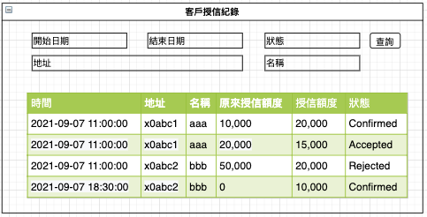

### 3.5 客戶結餘

顯示客戶實時在credit pool contract的結餘情況，其中等值的USDL可以用於計算出用戶已經使用的Credit及Equit情況

- Used credit = 所有結餘為負數等值USDL的總和

- Equity = 所有貨幣的等值USDL總和

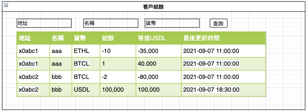

### 3.6 客戶額度紀錄

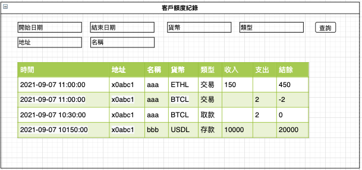

- 貨幣：USDL, BTCL, ETHL
- 額度紀錄：存款、取款、交易、強平

## 4 結算報表

### 4.1 日報表

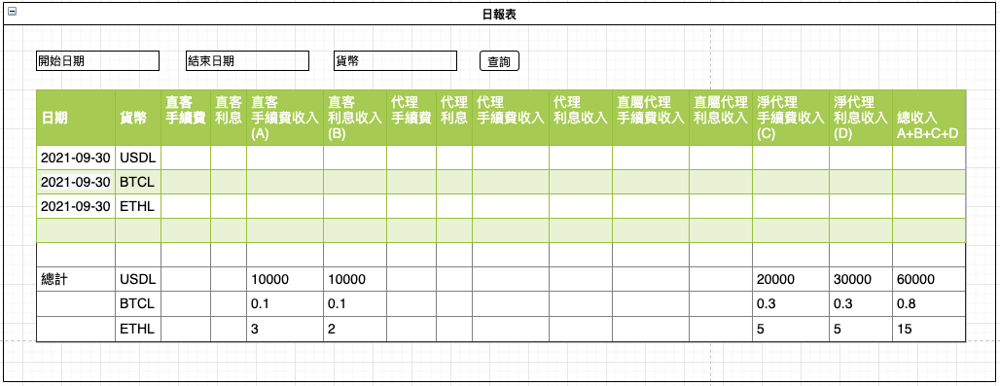

日報表計算方法由一下8個步驟組成，計算出各個節點的直客收入，在計算出每個節點的總收入再推算出每個節點的淨收入。

計算步驟參考下圖：

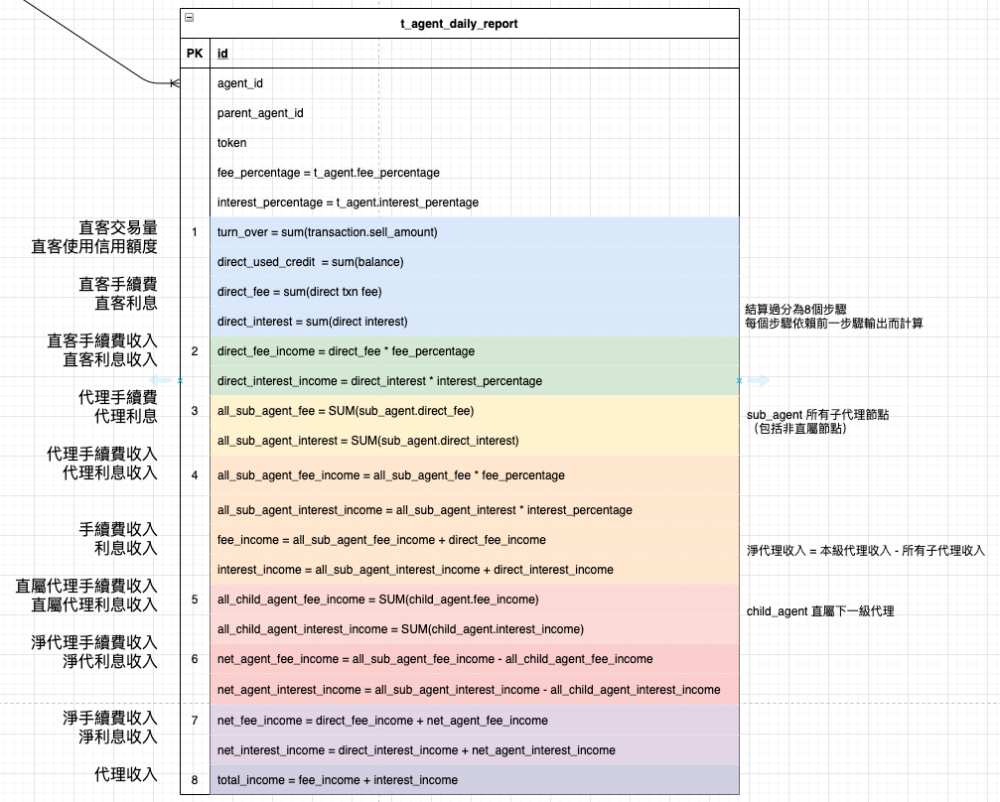

### 4.2 交易紀錄

通過Block scan獲取交易Event，紀錄在紀錄表中

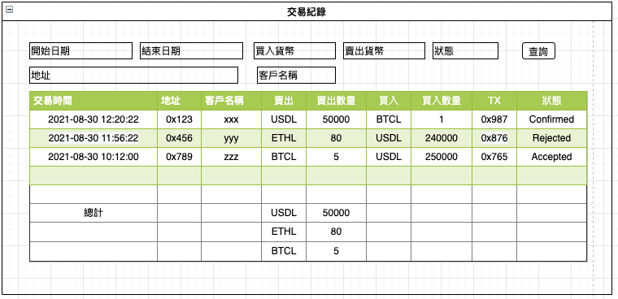

### 4.3 實際收息紀錄

- 系統對每種貨幣分別進行利息計算
- 只有負數結餘的貨幣需要計算利息
- 利息的實際收取發生在每次額度發生變化之前。因此，每次存款，取款，交易及搶平之前，均會先進行立即扣除。利息的計算根據用戶當時Credit使用量、佔用時長及利率進行計算。
- 佔用時長是計算自上次額度發生變化後到當前時間，划過正點時間的次數。

例如：當前額度USDL = -10000，BTCL = 5， ETHL = -10，利率都是0.01%，上次額度發生變化時間是10:30，現在是16:10，滑過正點的次數時6次。所以，如果用單利計算，USDL利息是 10000 * 6 *  0.01%  = 6， ETHL利息是 10 * 6 * 0.01% = 0.006

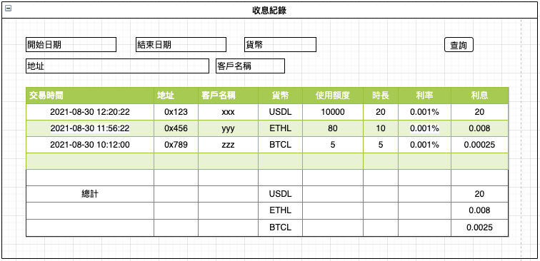