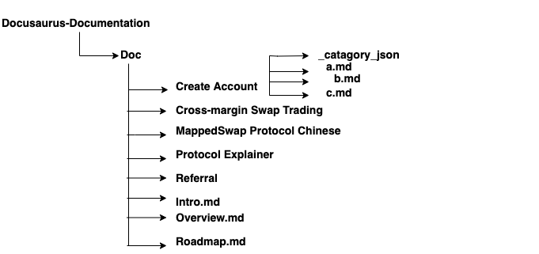
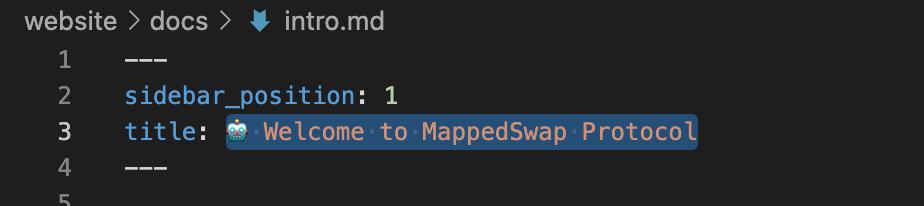
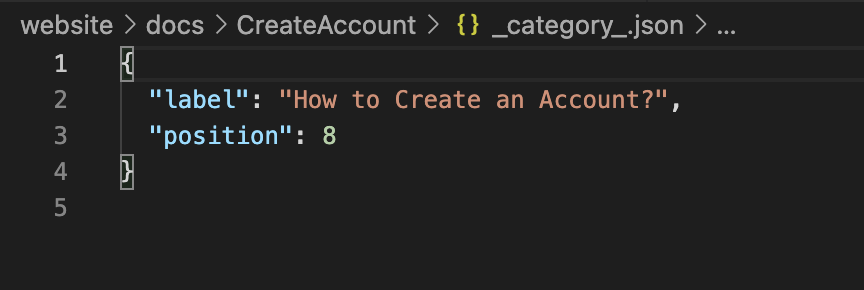

# MappedSwap Documentation
This is a website for MappedSwap documentation. An overview about how the documentation website is created and how to develop locally is descrbed here.

### Create Document
All the documentation files are stored inside the 'doc' folder. The items inside the doc folder appear on the sidebar of the MappedSwap Documentation [website](https://doc.mappedswap.io/). Therefore, it is very important to know how the doc folder is organized. The image below shows the doc folder structure: 



Docusaurus docs feature allows to organize the markdown files (.md files) as needed. Each document should have a sidebar_postion number and a title. For example, in this diagram Intro.md has the sidebar_position number = 1 and the title name = 🤖 Welcome to MappedSwap Protocol since this is first page of MappedSwapped documentation website. The next title should be postioned as sidebar_position number = 2 and so on.



In oder to organize multiple contents within one main title,  a folder is need to be created as shown in first picture here. There are multiple markdown files within the 'Create Account' folder and one .json file. 



Inside the .json file main title and the position of the main title needed to be specified.


### Installation

In order to download the website locally the following steps should be followed - 

#### Step 1: Hit the 'Download Zip' button or git clone from the command terminal.
 
```
$ git clone https://github.com/Mapped-Swap/Docusaurus-Documentation.git

```
Username and password needed to provide in order to clone the project. The password field requires the Personal access token instead of the GIthub password. To create a [Personal Access Token](https://docs.github.com/en/authentication/keeping-your-account-and-data-secure/creating-a-personal-access-token) please follow the Github documentation.

#### Step 2: You need to install node if you do not have node installed. 

```
$ nvm install node

```

#### Step 3: To install all the node packages enter the following command
```
$ npm i
```

### Local Development

```
$ npm start 
```
This command starts a local development server (http://localhost:3000/) and opens up a browser window. Most changes are reflected live without having to restart the server. After creating or changing and saving a markdown file the updated website will be shown here http://localhost:3000/

### Build
```
$ npm run build
```
This command generates static content into the `build` directory and can be served using any static contents hosting service.


