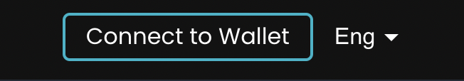
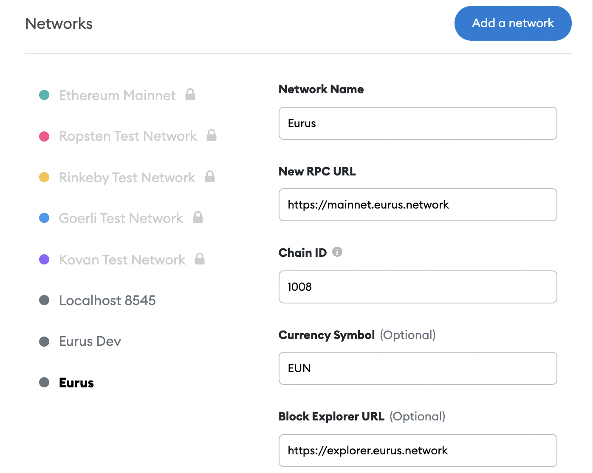

Users can choose either Eurus wallet or MetaMask to proceed：

## Eurus wallet

:::tip Connect to Eurus Wallet

* First, create an Eurus wallet. See [how to create it here](https://www.eurus.network/support/eurus-wallet/).

* Next, connect the Eurus wallet to the MappedSwap mainnet: Visit [MappedSwap](https://decatsdevapp.eurus.dev/dashboard) and click "Connect Wallet" on the top right.

* Connected successfully!

:::

## MetaMask 

:::tip Connect to MetaMask

1. First, you need to create a MetaMask wallet: Go to the official website to [download the wallet](https://metamask.io/download.html). 
If operating this on a computer, it is recommended to choose ["Install MetaMask for Chrome"](https://chrome.google.com/webstore/detail/metamask/nkbihfbeogaeaoehlefnkodbefgpgknn). Please see here for detailed instructions.

2. Since Ethereum is the default network of MetaMask, it is necessary to change the setting and connect MetaMask wallet to Eurus Network:
    * Click “Ethereum Main Network”, then choose “Add a network”.
    * Fill out the information below:
            1. Network Name: Customize (Recommended – Eurus) 
            2. New PRC URL: https://mainnet.eurus.network 
            3. ChainID: 1008 
            4. Symbol: EUN
            5. Block Explorer: https://explorer.eurus.network/#/

 3.  After finishing the setting, you will be able to operate your assets on the Eurus network.

 

 4. Next, you need to connect the MetaMask wallet to the [MappedSwap](https://decatsdevapp.eurus.dev/dashboard) 
 mainnet: Enter MappedSwap and click "Connect Wallet" on the top right.
 
 

 5. Connected successfully!
  
:::

