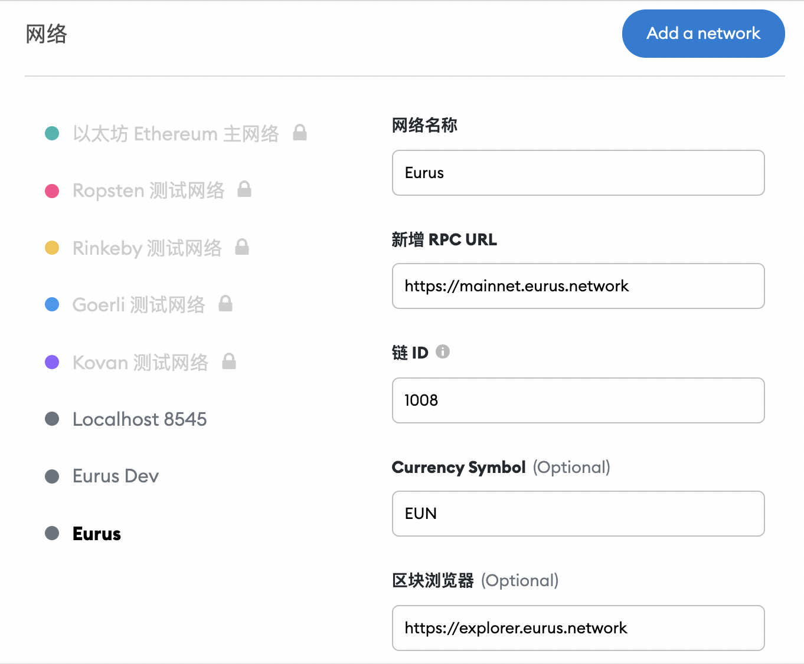

您可以选择使用 Eurus 钱包或 MetaMask 钱包连结：

## Eurus 钱包

:::tip 连结 Eurus 钱包

- 首先，您需要创建 Eurus 钱包，[请见此处创建教学](https://www.eurus.network/support/eurus-wallet/)。

- 再来，您需将 Eurus 钱包连结至 MappedSwap 主网：进入 [MappedSwap](https://decatsdevapp.eurus.dev/dashboard)，点选右上方「连结钱包」。

- 连结成功！

:::

## MetaMask 钱包

:::tip 连接 MetaMask 钱包

1. 首先，您需要创建 MetaMask 钱包：[进入官方网站下载钱包](https://metamask.io/download.html)。若您以电脑操作，建议选择["Install MetaMask for Chrome"](https://chrome.google.com/webstore/detail/metamask/nkbihfbeogaeaoehlefnkodbefgpgknn)。请见此处详细教学。

2. 由于 MetaMask 会预设在以太坊钱包，因此必须将 MetaMask 钱包配置连接到 Eurus：

   - 点击 「以太坊主网路」 后，选择「Add a network」。
   - 输入以下资讯： 
         1. 网络名称：可自定义（建议：Eurus） 
         2. 新增 RPC URL：https://mainnet.eurus.network 
         3. 链 ID：1008 
         4. 符号：EUN 
         5. 区块浏览器 URL：https://explorer.eurus.network/#/

3. 设置后，您将能够在 Eurus 网络上操作您的资产。

4.  再来，您需将 MetaMask 钱包连结至 [MappedSwap](https://decatsdevapp.eurus.dev/dashboard) 主网：进入 MappedSwap，点选右上方「连结钱包」。

5.  成功开户！

:::
