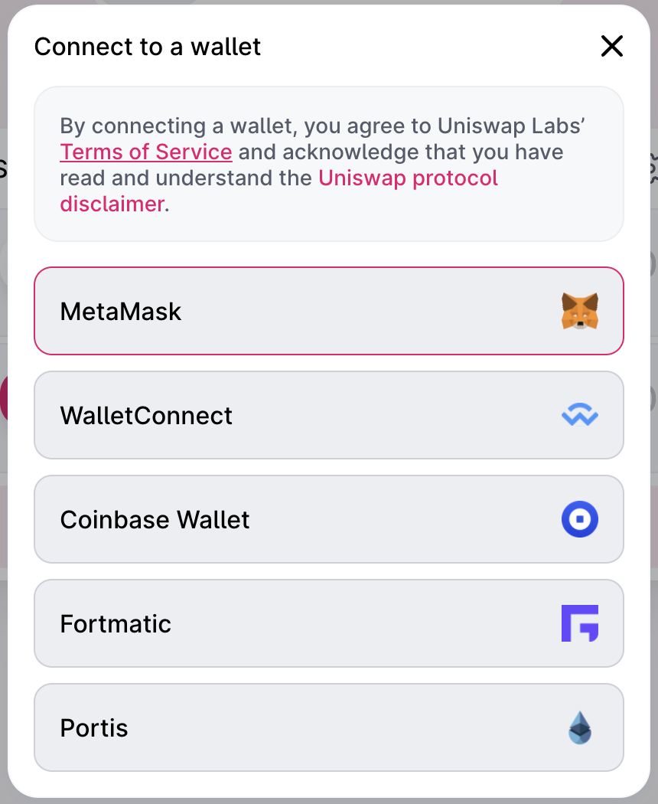
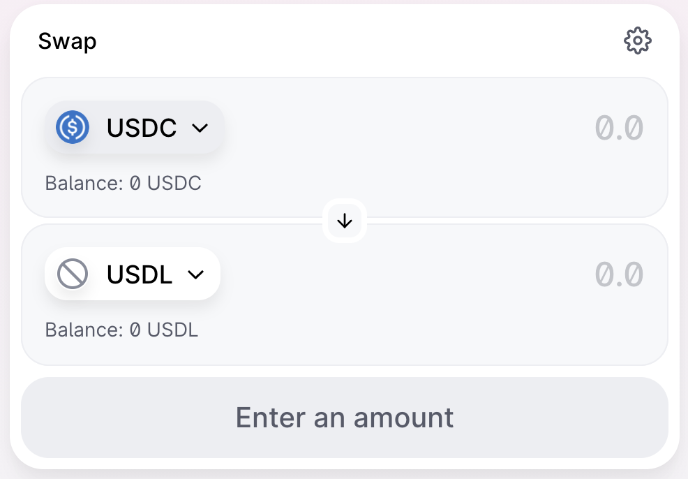

:::tip

您可以于 [Uniswap](https://app.uniswap.org/#/swap) 连结 MetaMask 钱包，将 USDC 兑换成 USDM。

:::

完成兑换后，将 USDM 于 Eurus 钱包进行以太链和 Eurus 链的跨链 （[请见此处设置教学](https://www.eurus.network/support/dapp-developer-portal/)），从而可在 Eurus 网络进行 MappedSwap 交易。

:::tip 示例

 

:::

### 延伸阅读：

:::tip Mapped Tokens 
[What are Mapped Tokens?](https://docs.mappedswap.io/docs/ProtocolExplainer/WhatAreTheMappedTokens) 
:::
